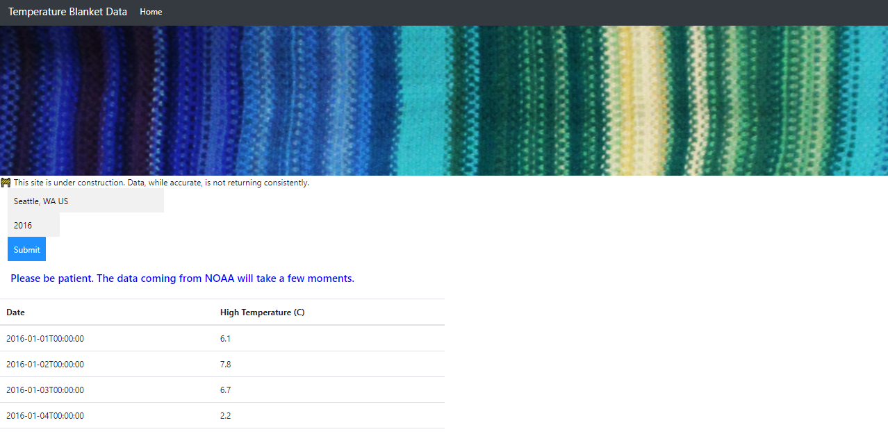

# temperature-blanket-data UNDER CONSTRUCTION

## Description
A temperature blanket is a crafty way to document the temperature for a given period of time. Fiber artists use different colors of yarn to represent each day's temperature through knitting, crochet, and any stitch or other craft they can imagine, all resulting in a beautiful, unique, and almost unpredictable pattern like the one pictured in the image below.

Each January, blogs and social media explode with new projects for the year ahead. But what if a crafter wants to commemorate a special year in the past? Perhaps a friend or relative's birth year, or anniversary? Those historical temperatures are not typically available on the weather app on a phone. That's why this app has been created.

The user enters the desired city and year to receive the high temperature for all 365 (or 366) days of the year.

## Note: fetch works inconsistently and VERY slowly at times. 
_Problem on NOAA's end?_

## Deployed App
https://shelleymcq.github.io/temperature-blanket-data/

## Next Steps
* Display data in multiple-column table
* Provide download data options
* Create a palette generator (MAJOR FUNCTIONALITY)
* Add an About page